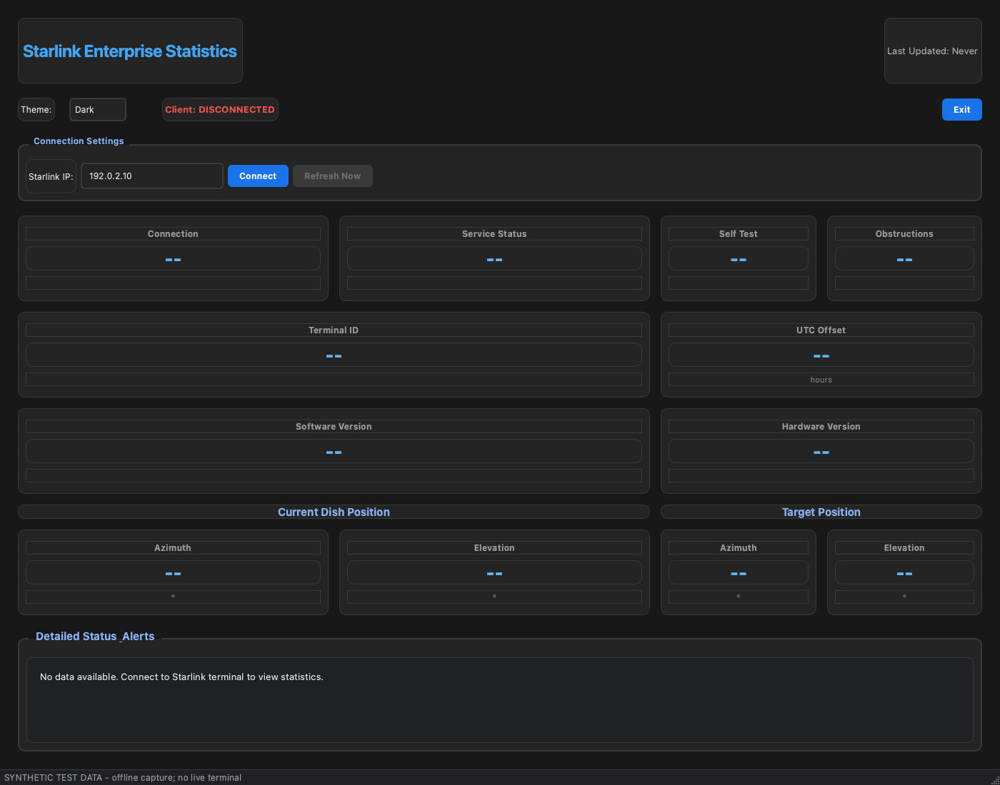
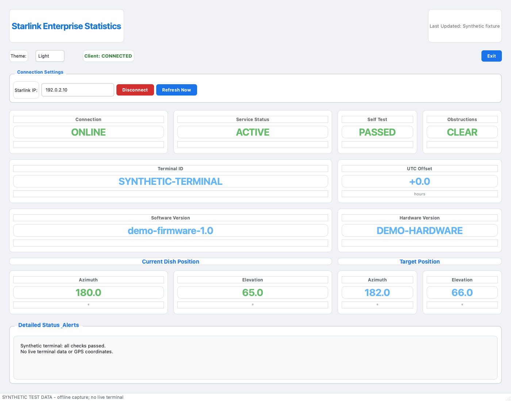
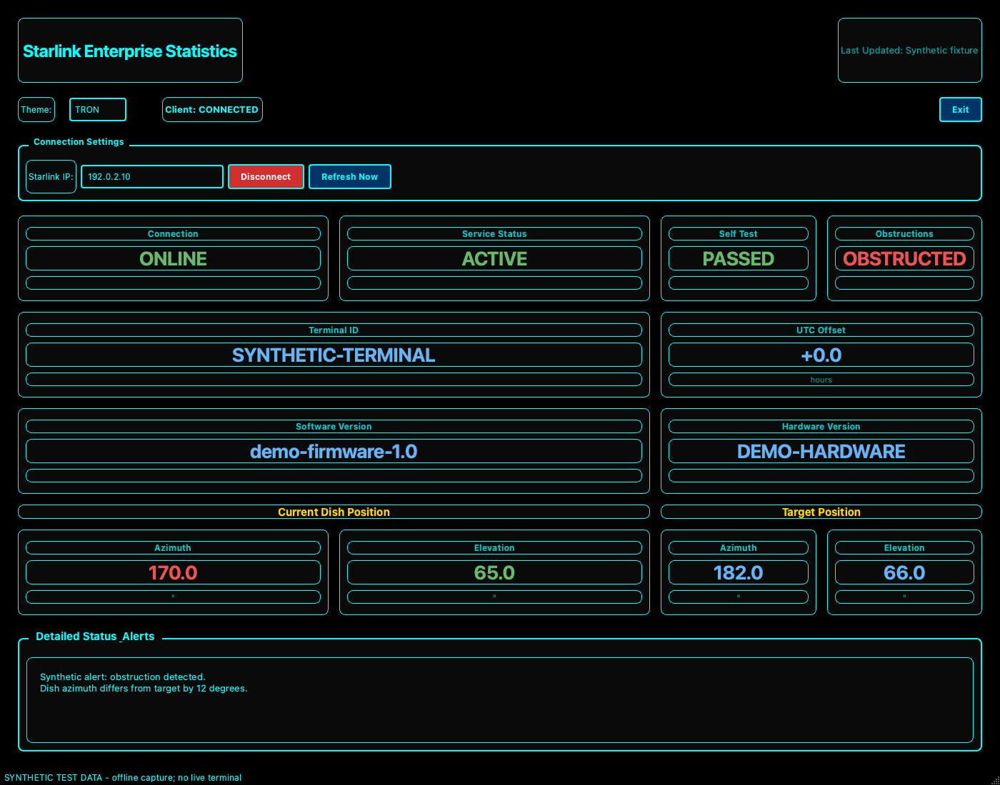

# Starlink Enterprise Dashboard

## What

A PyQt6 desktop app that shows the status, alerts, and alignment of a Starlink Enterprise terminal.

These are real app captures with synthetic test data. No live terminal supplied the data.

Ready to connect (Dark):



Active service (Light):



Obstruction alert (TRON):



## How

Use Python 3.13 or later. [Install the dependencies and protocol modules](docs/setup.md), then run:

```console
python starlink_dashboard.py
```

Enter the terminal address and click **Connect**. See the [operator guide](docs/operation.md) for controls and GPS privacy.

## Where

The app runs on your desktop. It reads the terminal's gRPC device API at port `9200`; the default address is `192.168.100.1`.

See the [setup guide](docs/setup.md), [operator guide](docs/operation.md), and [development guide](docs/development.md).

## When

Use the app when you need to check terminal health. While connected, it reads status every five seconds. Click **Refresh Now** for an immediate update.

## Why

The dashboard puts service status, self-test results, obstructions, and dish alignment in one view. It helps operators check WAN connectivity without reading raw protocol responses.

## Who

For NOC engineers and Starlink terminal operators. The code came from MistHelper; see [project origin and license](docs/project.md).

Report problems in [GitHub issues](https://github.com/jmorrison-juniper/starlink-dashboard/issues). See [development and safe screenshot capture](docs/development.md) before sharing app images.
